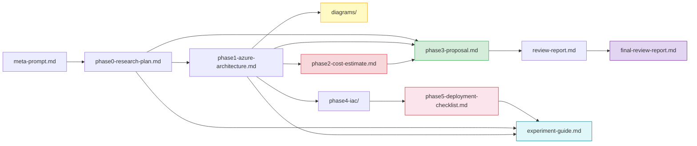

# SPReAD Builder パイプライン実行ガイド

研究調査から Bicep CI/CD デプロイまで — spread1000-builder の全機能を活用した完全ワークフロー

---

## 目次

1. [はじめに](#1-はじめに)
2. [全体アーキテクチャ](#2-全体アーキテクチャ)
3. [事前準備](#3-事前準備)
4. [パイプライン概要](#4-パイプライン概要)
5. [Pre: コンテキスト収集](#5-pre-コンテキスト収集)
6. [Phase 0: 研究プラン策定](#6-phase-0-研究プラン策定)
7. [Phase 1: Azure アーキテクチャ設計](#7-phase-1-azure-アーキテクチャ設計)
8. [Phase 1b: システム構成図生成（draw.io MCP）](#8-phase-1b-システム構成図生成drawio-mcp)
9. [Phase 2: コスト見積もり](#9-phase-2-コスト見積もり)
10. [Phase 3: 申請書作成](#10-phase-3-申請書作成)
11. [Phase 3b: 申請書レビュー](#11-phase-3b-申請書レビュー)
12. [Phase 3c: 提出前最終レビュー](#12-phase-3c-提出前最終レビュー)
13. [Phase 4: 応募手続き](#13-phase-4-応募手続き)
14. [Phase 5: Bicep / CI/CD 生成](#14-phase-5-bicep--cicd-生成)
15. [Phase 5b: Azure デプロイ](#15-phase-5b-azure-デプロイ)
16. [Phase 5c: 実験手順書](#16-phase-5c-実験手順書)
17. [Phase 6: 採択後管理](#17-phase-6-採択後管理)
18. [プロンプト設計パターン集](#18-プロンプト設計パターン集)
19. [トラブルシューティング](#19-トラブルシューティング)
20. [成果物マップ](#20-成果物マップ)

---

## 1. はじめに

### 1.1 本書の目的

本書は、`spread1000-builder`（GitHub Copilot / Claude Code スキルスイート）を使用して、文部科学省「AI for Science 萌芽的挑戦研究創出事業（SPReAD）」の研究計画策定から Azure 基盤デプロイまでを一貫して実行するための**ステップバイステップガイド**です。

### 1.2 対象読者

- SPReAD への応募を検討している研究者
- AI を自身の研究に活用したいが方法がわからない方
- Azure 上に研究基盤を構築したい方
- GitHub Copilot または Claude Code を活用して研究申請書を作成したい方

### 1.3 spread1000-builder とは

12のサブスキルと2つの専門エージェントで構成される GitHub Copilot / Claude Code 向けスイートです。研究者の漠然とした構想から、具体的な申請書・インフラコードまでを自動生成します。

| コンポーネント | 種類 | 役割 |
|--------------|------|------|
| `spread1000-context-collector` | Skill | 1問1答でコンテキスト収集 → メタプロンプト生成 |
| `spread1000-research-planner` | Skill | AI for Science 研究プランの策定（ToolUniverse MCP による文献調査） |
| `spread1000-azure-architect` | Skill | Azure アーキテクチャ設計 |
| `spread1000-cost-estimator` | Skill | Azure Retail Prices API による実価格コスト算出 |
| `spread1000-proposal-writer` | Skill | SPReAD 申請書の生成 |
| `spread1000-submission-guide` | Skill | AI インタビュー・e-Rad・応募手続きガイド |
| `spread1000-diagram-generator` | Skill | draw.io MCP によるシステム構成図生成 |
| `spread1000-post-award` | Skill | 採択後の管理・報告支援 |
| `spread1000-iac-deployer` | Skill | Bicep テンプレート・CI/CD パイプライン生成 |
| `spread1000-azure-deployer` | Skill | Azure デプロイ実行・OIDC設定・デプロイ後検証 |
| `spread1000-experiment-guide` | Skill | 実験手順書生成（環境構築・学習・推論・再現性管理） |
| `spread1000-final-reviewer` | Skill | 提出前最終レビュー・6審査観点スコアリング・提出可否判定 |
| `research-advisor` | Agent | フルツール統合支援エージェント |
| `proposal-reviewer` | Agent | 読み取り専用の品質レビューエージェント |

---

## 2. 全体アーキテクチャ

### 2.1 パイプラインフロー

```mermaid
flowchart TD
    Start([研究者のプロンプト]) --> CtxCheck{コンテキスト充足度<br/>6要素中4つ以上?}
    
    CtxCheck -->|NO| Pre[Pre: context-collector<br/>1問1答で情報収集]
    Pre --> MetaPrompt[メタプロンプト生成<br/>output/meta-prompt.md]
    MetaPrompt --> Approve1{ユーザー承認}
    Approve1 -->|承認| Phase0
    
    CtxCheck -->|YES| Phase0[Phase 0: research-planner<br/>AI活用研究プラン策定]
    Phase0 --> ResearchPlan[output/phase0-research-plan.md]
    ResearchPlan --> Approve2{ユーザー承認}
    
    Approve2 -->|承認| Phase1[Phase 1: azure-architect<br/>Azure基盤設計]
    Phase1 --> Architecture[output/phase1-azure-architecture.md]
    Architecture --> Approve3{ユーザー承認}
    
    Approve3 -->|承認| Phase1b[Phase 1b: diagram-generator<br/>draw.io 構成図]
    Phase1b --> Diagrams[output/diagrams/]
    
    Diagrams --> Phase2[Phase 2: cost-estimator<br/>Azure Retail Prices API]
    Phase2 --> CostEstimate[output/phase2-cost-estimate.md]
    
    CostEstimate --> BudgetCheck{直接経費<br/>500万円以下?}
    BudgetCheck -->|超過| Phase2
    BudgetCheck -->|OK| Phase3[Phase 3: proposal-writer<br/>申請書生成]
    
    Phase3 --> Proposal[output/phase3-proposal.md]
    Proposal --> Approve4{ユーザー承認}
    
    Approve4 -->|承認| Phase3b[Phase 3b: proposal-reviewer<br/>品質レビュー]
    Phase3b --> Review[output/review-report.md]
    Review --> NeedsFix{改善必要?}
    NeedsFix -->|YES| Phase3
    NeedsFix -->|NO| Phase3c
    
    Phase3c[Phase 3c: final-reviewer<br/>提出前最終レビュー] --> FinalReview[output/final-review-report.md]
    FinalReview --> ReadyCheck{提出可否判定}
    ReadyCheck -->|🟢 提出推奨| Phase4
    ReadyCheck -->|🟡 改善推奨| Phase3
    ReadyCheck -->|🔴 大幅改善| Phase0
    
    Phase4[Phase 4: submission-guide<br/>応募手続き] --> Checklist[output/submission-checklist.md]
    
    Checklist --> Phase5[Phase 5: iac-deployer<br/>Bicep / CI/CD]
    Phase5 --> IaC[output/phase4-iac/]
    
    IaC --> Phase5b[Phase 5b: azure-deployer<br/>Azure デプロイ実行]
    Phase5b --> DeployChecklist[output/phase5-deployment-checklist.md]
    
    DeployChecklist --> Phase5c[Phase 5c: experiment-guide<br/>実験手順書生成]
    Phase5c --> ExperimentGuide[output/experiment-guide.md]
    
    ExperimentGuide --> Phase6[Phase 6: post-award<br/>採択後管理]
    Phase6 --> Roadmap[output/post-award-roadmap.md]
    
    style Pre fill:#fff3cd
    style Phase0 fill:#d1ecf1
    style Phase1 fill:#d1ecf1
    style Phase2 fill:#f8d7da
    style Phase3 fill:#d4edda
    style Phase3b fill:#e2d5f1
    style Phase3c fill:#e2d5f1
    style Phase4 fill:#d1ecf1
    style Phase1b fill:#fff9c4
    style Phase5 fill:#fce4ec
    style Phase5b fill:#fce4ec
    style Phase5c fill:#e0f7fa
    style Phase6 fill:#e8f5e9
```



### 2.2 ルーティングの仕組み

`AGENTS.md` のオーケストレーターが、ユーザーのプロンプトに含まれるキーワードを解析し、最も適切なサブスキルに自動ルーティングします。

| ユーザーの意図 | ルーティング先 |
|--------------|--------------|
| 「研究テーマへのAI活用方法を知りたい」 | `research-planner` |
| 「Azure構成を設計したい」 | `azure-architect` |
| 「コストを見積もりたい」 | `cost-estimator` |
| 「申請書を作成したい」 | `cost-estimator` → `proposal-writer`（順序保証） |
| 「申請書をレビューして」 | `proposal-reviewer` agent |
| 「提出前の最終チェック」「スコアリングして」 | `final-reviewer` |
| 「システム構成図を作りたい」 | `diagram-generator` |
| 「e-Rad の手続きを教えて」 | `submission-guide` |
| 「Bicep を生成したい」 | `iac-deployer` |
| 「Azure にデプロイしたい」「OIDC設定」 | `azure-deployer` |
| 「実験手順書を作りたい」「学習ジョブを投入したい」 | `experiment-guide` |
| 「採択後の手続きは？」 | `post-award` |

### 2.3 承認ゲート（⏸️）

パイプラインの各フェーズ間にはユーザー承認ゲートが設けられています。エージェントが自動で次フェーズに進むことはありません。

```
Pre  ⏸️→ Phase 0 ⏸️→ Phase 1 → Phase 1b ⏸️→ Phase 2 → Phase 3 ⏸️→ Phase 3b ⏸️→ Phase 3c ⏸️→ Phase 4 → Phase 5 → Phase 5b → Phase 5c → Phase 6
```

---

## 3. 事前準備

### 3.1 インストール

```bash
# プロジェクトディレクトリで実行
npm install @nahisaho/spread1000-builder

# draw.io MCP + ToolUniverse MCP まで含めて初期設定する場合
npx @nahisaho/spread1000-builder init
```

> **ToolUniverse MCP** が同時に設定されます。`uv` が未インストールの場合はスキップされ、警告が表示されます。
> インストール: `curl -LsSf https://astral.sh/uv/install.sh | sh`

インストールにより、以下が自動配置されます:

```
.github/
├── AGENTS.md                          # オーケストレーター
├── copilot-instructions.md            # スイート規約
├── agents/
│   ├── research-advisor.agent.md      # フルツールエージェント
│   └── proposal-reviewer.agent.md     # 読み取り専用レビューア
└── skills/
    ├── spread1000-context-collector/   # SKILL.md + assets/
    ├── spread1000-research-planner/    # SKILL.md + assets/ + references/
    ├── spread1000-azure-architect/     # SKILL.md + assets/ + references/
    ├── spread1000-cost-estimator/      # SKILL.md + assets/
    ├── spread1000-proposal-writer/     # SKILL.md + assets/ + references/
    ├── spread1000-submission-guide/    # SKILL.md + assets/ + references/
    ├── spread1000-post-award/         # SKILL.md + references/
    ├── spread1000-iac-deployer/       # SKILL.md + references/
    ├── spread1000-azure-deployer/     # SKILL.md + assets/ + references/
    ├── spread1000-experiment-guide/   # SKILL.md + assets/
    └── spread1000-final-reviewer/     # SKILL.md + assets/ + references/

.vscode/
└── mcp.json                           # ToolUniverse MCP + draw.io MCP の設定

.claude/
├── agents/
│   ├── research-advisor.md            # Claude Code 用 subagent
│   └── proposal-reviewer.md           # Claude Code 用 subagent
└── skills/
   ├── spread1000-context-collector/
   ├── spread1000-research-planner/
   ├── spread1000-azure-architect/
   ├── spread1000-cost-estimator/
   ├── spread1000-proposal-writer/
   ├── spread1000-submission-guide/
   ├── spread1000-post-award/
   ├── spread1000-iac-deployer/
   ├── spread1000-azure-deployer/
   ├── spread1000-experiment-guide/
   └── spread1000-final-reviewer/

CLAUDE.md                              # Claude Code 指示ファイル
.mcp.json                              # ToolUniverse MCP 設定（Claude Code 用）
```

### 3.2 必要な環境

| 項目 | 要件 |
|------|------|
| VS Code | 最新版 |
| GitHub Copilot または Claude Code | いずれかのエージェント実行環境 |
| Node.js | v18 以上 |
| uv | Phase 0 ToolUniverse MCP 使用時（必須）— [インストール](https://docs.astral.sh/uv/getting-started/installation/) |
| Azure CLI | デプロイ時のみ必要 |

### 3.3 出力ディレクトリ

全成果物は `output/` ディレクトリに自動保存されます。チャットにのみ結果が残ることはありません（File-First Output Policy）。

---

## 4. パイプライン概要

### 4.1 フルワークフロー（8フェーズ）

| Phase | スキル | 入力 | 出力 |
|-------|--------|------|------|
| Pre | `context-collector` | ユーザーの曖昧なプロンプト | `meta-prompt.md` |
| 0 | `research-planner` | メタプロンプト or 明確なプロンプト | `phase0-research-plan.md` |
| 1 | `azure-architect` | 研究プラン | `phase1-azure-architecture.md` |
| 1b | `diagram-generator` | Azure構成設計書 | `output/diagrams/*.drawio` |
| 2 | `cost-estimator` | Azure構成設計書 | `phase2-cost-estimate.md` |
| 3 | `proposal-writer` | Phase 0-2 の全成果物 | `phase3-proposal.md` |
| 3b | `proposal-reviewer` | 申請書 | `review-report.md` |
| 3c | `final-reviewer` | 全フェーズ成果物 | `final-review-report.md` |
| 4 | `submission-guide` | 応募者属性 | `submission-checklist.md` |
| 5 | `iac-deployer` | Azure構成設計書 | `phase4-iac/` |
| 5b | `azure-deployer` | Bicepテンプレート一式 | `phase5-deployment-checklist.md` |
| 5c | `experiment-guide` | Azure構成設計書・研究プラン・デプロイチェックリスト | `experiment-guide.md` |
| 6 | `post-award` | 採択課題情報 | `post-award-roadmap.md` |

### 4.2 緊急度別ワークフロー

| 緊急度 | キーワード | 実行フェーズ |
|--------|----------|------------|
| Normal | （デフォルト） | Pre → Phase 0〜6 |
| Urgent | 「急ぎ」「締切直前」 | Pre → Phase 0+2+3 |
| Critical | 「今すぐ」 | Pre → Phase 2+3 |

> ⚠️ **Phase 2（コスト見積もり）はどの緊急度でもスキップ不可。** Azure Retail Prices API からの実価格取得なしに経費欄を埋めることは禁止されています。

---

## 5. Pre: コンテキスト収集

### 5.1 このフェーズの目的

ユーザーのプロンプトに含まれる情報が不十分な場合に、1問1答形式で不足情報を収集し、後続フェーズの入力精度を最大化します。

### 5.2 起動条件

6つの要素のうち **3つ以上が不明** の場合に自動起動します。

| 要素 | SPReAD での意味 | 判定基準 |
|------|---------------|---------|
| PURPOSE | 研究の目的 | 「〜を解明」「〜を予測」等の動詞があるか |
| TARGET | 研究対象・分野 | 具体的な学問分野が明示されているか |
| SCOPE | 研究の範囲・規模 | データ規模・対象期間の言及があるか |
| TIMELINE | 研究期間 | 約180日間・締切日の言及があるか |
| CONSTRAINTS | 制約条件 | 予算・設備の言及があるか |
| DELIVERABLES | 期待成果物 | 論文・モデル等の言及があるか |

### 5.3 実行手順

**ステップ 1: プロンプトを入力する**

```
@research-advisor 材料科学の研究にAIを使いたいと思っています。SPReADに応募したいです。
```

> このプロンプトでは PURPOSE（AIを使いたい）と TARGET（材料科学）は判明するが、SCOPE, TIMELINE, CONSTRAINTS, DELIVERABLES が不明 → 不足4要素 ≥ 3 → `context-collector` が起動

**ステップ 2: 1問1答に回答する**

エージェントが以下の形式で1問ずつ質問します。1回のメッセージで複数質問が来ることはありません。

```markdown
## ❓ 質問 1/5
**カテゴリ**: WHY
この研究で AI を使って何を達成したいですか？
（例: 新規触媒材料の候補を網羅的にスクリーニングしたい）
```

回答例:
```
ベイズ最適化と生成AIモデルを組み合わせて、CO2還元触媒の
新規候補材料を高速に探索したい。
```

**ステップ 3: メタプロンプトを承認する**

全質問への回答後、構造化メタプロンプトが表示されます。

```markdown
## 📋 構造化メタプロンプト

| 要素 | 内容 |
|------|------|
| PURPOSE | ベイズ最適化+生成AIによるCO2還元触媒探索 |
| TARGET | 無機固体触媒・材料科学 |
| SCOPE | 10万組成規模のスクリーニング |
| TIMELINE | 約180日間（SPReAD研究期間） |
| CONSTRAINTS | 直接経費500万円以下、GPU計算必要 |
| DELIVERABLES | 高効率触媒候補10件、論文1本、OSSパイプライン |

この内容で研究プラン策定を進めてよろしいですか？
```

「はい」と回答すると Phase 0 に進みます。

### 5.4 出力ファイル

- `output/meta-prompt.md` — 構造化メタプロンプト

### 5.5 プロンプトのコツ

| ❌ 悪い例 | ✅ 良い例 |
|----------|----------|
| 「AIで研究したい」 | 「タンパク質の立体構造予測にAIを使い、創薬候補のスクリーニングを加速したい」 |
| 「SPReADに出したい」 | 「気象学の研究でAurora基盤モデルを使い、局地豪雨予測のリードタイムを60分に延伸したい。SPReADに応募する」 |

> **Tips**: 初回プロンプトに PURPOSE, TARGET, SCOPE の3要素を含めると、context-collector がスキップされ、直接 Phase 0 に進みます。

---

## 6. Phase 0: 研究プラン策定

### 6.1 このフェーズの目的

研究テーマに最適な AI/ML 活用方法を文献調査で調査し、180日間の研究計画を策定します。

### 6.2 起動スキル

`spread1000-research-planner`

> **重要: 呼び出しフロー**
> `@research-advisor` はオーケストレーターです。Phase 0 の実処理は必ず `spread1000-research-planner` スキルに委譲されます。エージェントが直接 Web リサーチを実行するのは ToolUniverse MCP が利用不可の場合のフォールバックのみです。
>
> ```
> ✅ 正解: @research-advisor → spread1000-research-planner → ToolUniverse MCP → phase0 生成
> ❌ 誤り: @research-advisor → (直接 Web リサーチ) → phase0 生成（ToolUniverse 未使用）
> ```

### 6.3 実行手順

**プロンプト例 1: 分野とテーマを指定する**

```
@research-advisor 材料科学分野でベイズ最適化と MatterGen を組み合わせた
CO2還元触媒の探索研究を計画してください。
SPReAD（約180日間、直接経費500万円以下）に応募します。
```

**プロンプト例 2: 課題を伝えて提案を求める**

```
@research-advisor 有機化学の研究をしています。
新規化合物の合成経路をAIで効率化したいのですが、
どのようなアプローチが考えられますか？SPReAD応募を検討中です。
```

### 6.4 エージェントの動作

1. **ToolUniverse MCP リサーチ**（一次情報源 — `tooluniverse` MCP サーバーが必要）:
   科学データベース・文献を横断的に検索します。

   | MCP ツール | 用途 |
   |-----------|------|
   | `find_tools("literature search AI for Science")` | 利用可能ツールの発見 |
   | `execute_tool("PubMed_search_articles", {...})` | PubMed 文献検索 |
   | `execute_tool("ArXiv_search_papers", {...})` | arXiv プレプリント検索 |
   | `execute_tool("SemanticScholar_search_papers", {...})` | Semantic Scholar 検索 |
   | `execute_tool("EuropePMC_search", {...})` | Europe PMC 検索 |
   | 分野別ツール（UniProt, ChEMBL, PubChem 等） | `find_tools("<分野> database")` で発見 |

   > ToolUniverse は 1,200+ の科学ツール（PubMed, UniProt, ChEMBL, FAERS, ClinicalTrials.gov 等）へのアクセスを提供します。
   > MCP が利用不可の場合は Web リサーチにフォールバックします。

2. **Web リサーチ**（補完情報源 — ToolUniverse 後に実行）:
   - Azure AI Foundry モデルカタログ（Aurora, MatterGen, BioEmu 等）
   - Microsoft Research AI for Science
   - JST サイト（SPReAD 最新公募情報）

3. **AI 活用方針の策定** — 研究課題と AI 手法のマッピング表を作成

4. **研究プラン生成** — 以下のセクションで構成:
   - 研究の背景と課題（ToolUniverse 取得文献を引用）
   - AI 活用戦略（データ収集 → 前処理 → モデリング → 検証）
   - 180日間のマイルストーン
   - 必要な計算リソースの概算
   - 期待される成果

### 6.5 出力ファイル

- `output/phase0-research-plan.md` — AI 活用研究プラン（ToolUniverse 取得文献を引用）
- `output/phase0-research-survey.md` — 文献・データベースリサーチ結果サマリー

### 6.6 品質ゲート

承認前に以下を確認してください:

- [ ] ToolUniverse MCP が呼び出され、結果が引用されているか（未使用の場合は理由が記載されているか）
- [ ] 研究テーマと AI 手法の対応が明確か
- [ ] 3件以上の関連事例が DOI / URL 付きで引用されているか
- [ ] 計算リソースが定量的に見積もられているか
- [ ] 研究スケジュールにマイルストーンがあるか
- [ ] AI for Science の文脈での新規性が説明されているか

---

## 7. Phase 1: Azure アーキテクチャ設計

### 7.1 このフェーズの目的

研究プランに基づき、Azure 上の研究基盤アーキテクチャを設計します。GPU クラスタ、ストレージ、ネットワーク、セキュリティの構成を決定します。

### 7.2 起動スキル

`spread1000-azure-architect`

### 7.3 実行手順

**プロンプト例: 研究プランに基づく自動設計**

```
@research-advisor Phase 0 の研究プランに基づいて
Azure アーキテクチャを設計してください。
Japan East リージョンで、Spot VM を活用してコストを最適化してください。
```

**プロンプト例: 具体的な要件を指定する**

```
@research-advisor 以下の要件で Azure 構成を設計してください:
- GPU: A100 80GB × 4台相当（分散学習、約1200時間）
- ストレージ: 2TB（高速I/O、分子シミュレーションデータ）
- セキュリティ: VNet + Private Endpoint
- 期間: 6ヶ月
```

### 7.4 エージェントの動作

1. **研究プランの計算要件を抽出**
2. **Azure サービス選定**:
   - コンピューティング: VM シリーズ（NC/ND/HB）、Azure ML、Azure Batch
   - ストレージ: Blob Storage、Managed Lustre、NetApp Files
   - AI: Azure AI Foundry、Azure OpenAI
   - ネットワーク: VNet、Private Endpoint
3. **アーキテクチャ図の生成** — Mermaid 形式
4. **セキュリティ設計** — RBAC、暗号化、Key Vault
5. **WAF ベストプラクティス検証** — Azure Well-Architected Framework の5本柱で設計を検証:
   - 各 Azure サービスの WAF Service Guide を Microsoft Learn から `fetch` で取得
   - 信頼性 / セキュリティ / コスト最適化 / 運用優秀性 / パフォーマンス効率の各チェックリストを照合
   - 構成推奨事項（Configuration recommendations）を設計に反映
   - 不適合項目があれば設計を修正し再検証
   - 検証結果を構成設計書の「WAF ベストプラクティス適合状況」セクションに記載

**参照される WAF Service Guide（主要サービス）:**

| サービス | URL |
|---------|-----|
| Azure Machine Learning | https://learn.microsoft.com/azure/well-architected/service-guides/azure-machine-learning |
| Azure Blob Storage | https://learn.microsoft.com/azure/well-architected/service-guides/azure-blob-storage |
| Azure Key Vault | https://learn.microsoft.com/azure/well-architected/service-guides/azure-key-vault |
| Azure Virtual Network | https://learn.microsoft.com/azure/well-architected/service-guides/azure-virtual-network |

### 7.5 出力ファイル

- `output/phase1-azure-architecture.md` — Azure 構成設計書（Mermaid 図含む）

### 7.6 重要な注意点

> ⚠️ **GPU VM のリージョン可用性**: ND96asr_v4（A100×8）は Japan East で未提供です。代替として NC24ads_A100_v4（A100×1）を複数台構成で使用するか、East US を選択してください。

> ⚠️ **セキュリティ**: 医療データを扱う場合は Azure Health Data Services + Private Endpoint が必須です。

---

## 8. Phase 1b: システム構成図生成（draw.io MCP）

### 8.1 このフェーズの目的

draw.io MCP Server を使用して、Azure 研究基盤のプロフェッショナルなシステム構成図・データフロー図・ネットワーク図を `.drawio` 形式で生成します。Phase 1 の Mermaid 図を補完し、Azure 公式アイコンを使った詳細な図面を作成します。Phase 1 直後に実行することで、構成図を Phase 3（申請書）に添付できます。

### 8.2 起動スキル

`spread1000-diagram-generator`

### 8.3 前提条件: draw.io MCP Server のセットアップ

3つの方法から選択してください:

| 方法 | セットアップ | 特徴 |
|------|-----------|------|
| MCP App Server（推奨） | リモート MCP `https://mcp.draw.io/mcp` を追加 | インストール不要、チャット内表示 |
| MCP Tool Server | `npx @drawio/mcp` | ローカル、ブラウザで開く |
| Skill + CLI | draw.io Desktop 必要 | PNG/SVG/PDF エクスポート可 |

**VS Code での設定例（MCP Tool Server）:**

`.vscode/mcp.json`:
```json
{
  "servers": {
    "drawio": {
      "command": "npx",
      "args": ["@drawio/mcp"]
    }
  }
}
```

### 8.4 実行手順

**プロンプト例: 構成設計書から自動生成**

```
@research-advisor Phase 1 の Azure 構成設計書からシステム構成図を
draw.io 形式で生成してください。Azure 公式アイコンを使用してください。
```

**プロンプト例: 特定の図面タイプを指定**

```
@research-advisor データフロー図を draw.io で作成してください。
ERA5 データ取得 → 前処理 → Aurora 転移学習 → 推論 → 結果保存 の流れを描いてください。
```

**プロンプト例: ネットワーク・セキュリティ図**

```
@research-advisor VNet 内のネットワーク分離とセキュリティ構成を
draw.io で図面化してください。Private Endpoint と NSG を含めてください。
```

### 8.5 エージェントの動作

1. **構成設計書の解析** — Phase 1 から全リソースと接続関係を抽出
2. **Azure アイコン取得** — `search_shapes` で公式アイコンの style 文字列を取得:
   ```
   search_shapes("Azure Virtual Machine")
   search_shapes("Azure Blob Storage")
   search_shapes("Azure Key Vault")
   search_shapes("Azure Machine Learning")
   search_shapes("Azure Virtual Network")
   ```
3. **draw.io XML 生成** — リジッドグリッドに従い、コンテナのネスト構造で図面を構成
4. **図面出力** — `create_diagram` で図を生成、XML を `output/diagrams/` に保存

### 8.6 生成される図面

| 図面 | ファイル | 用途 |
|------|---------|------|
| システム構成図 | `output/diagrams/system-architecture.drawio` | 申請書 §4「研究基盤計画」 |
| データフロー図 | `output/diagrams/data-flow.drawio` | 申請書 §3「研究計画・方法論」 |
| ネットワーク図 | `output/diagrams/network-security.drawio` | セキュリティ設計の可視化 |
| CI/CD 図 | `output/diagrams/cicd-pipeline.drawio` | Phase 5 の Bicep デプロイフロー |

### 8.7 出力ファイル

- `output/diagrams/*.drawio` — draw.io 形式の図面（4種類）

> 図面は [draw.io Desktop](https://github.com/jgraph/drawio-desktop) または https://app.diagrams.net で開いて編集可能です。

### 8.8 品質ゲート

- [ ] 全 Azure リソースが Phase 1 構成設計書と一致
- [ ] Azure 公式アイコンが `search_shapes` で取得・使用されている
- [ ] リソース間の接続が正確
- [ ] VNet/Subnet のネスト構造が正しい
- [ ] ラベルが日本語
- [ ] XML が well-formed

---

## 9. Phase 2: コスト見積もり

### 9.1 このフェーズの目的

Azure Retail Prices API から**実際の最新価格**を取得し、SPReAD の予算制約（直接経費500万円以下）に収まるコスト見積もりを生成します。

### 9.2 起動スキル

`spread1000-cost-estimator`

### 9.3 なぜこのフェーズが最重要か

> 🚫 **LLM の記憶・推定値でコストを算出することは禁止されています。**

このスキルは、エージェントに Azure Retail Prices API（`https://prices.azure.com/api/retail/prices`）を**実際に呼び出させ**、レスポンス JSON から `retailPrice` を抽出してコストを算出します。API 呼び出しがスキップされた場合、見積もり書に `⚠️ 価格未検証（推定値）` と警告が表示されます。

### 9.4 実行手順

**プロンプト例:**

```
@research-advisor Phase 1 の Azure 構成設計に基づいて
コスト見積もりを作成してください。
Japan East リージョン、Spot VM 活用、研究期間6ヶ月で積算してください。
```

### 9.5 エージェントの動作

1. **構成設計書から VM SKU・ストレージ容量を抽出**
2. **Azure Retail Prices API を呼び出し**:
   ```
   https://prices.azure.com/api/retail/prices?$filter=
     serviceName eq 'Virtual Machines' 
     and armRegionName eq 'japaneast' 
     and armSkuName eq 'Standard_NC24ads_A100_v4'
   ```
3. **Pay-As-You-Go / Spot / Reserved Instance 価格を取得**
4. **為替レート取得** — 公開 API で最新 USD/JPY を取得
5. **予算チェック** — 直接経費 500万円以下に収まるか検証
6. **コスト最適化オプションの提案** — Spot VM、RI、シャットダウンスケジュール

### 9.6 出力ファイル

- `output/phase2-cost-estimate.md` — コスト見積もり書

### 9.7 HARD GATE（必須チェック）

見積もり書の最終化前に、以下を**全て**パスする必要があります:

- [ ] 全 VM SKU の単価が API または公式ページから取得済み
- [ ] 取得日が記録されている
- [ ] 取得元 URL が記録されている
- [ ] 為替レートの出典が明記されている
- [ ] LLM 推定値のみの費目が存在しない

### 9.8 予算制約

| 項目 | 上限 |
|------|------|
| 直接経費 | 500万円以下 |
| 間接経費 | 直接経費の30%（最大150万円） |
| 補助金総額 | 最大650万円 |
| 最低研究経費 | 10万円以上 |

---

## 10. Phase 3: 申請書作成

### 10.1 このフェーズの目的

Phase 0〜2 の全成果物を統合し、SPReAD 公募要領に準拠した申請書（研究計画書）を生成します。

### 10.2 起動スキル

`spread1000-proposal-writer`

### 10.3 前提条件（MANDATORY）

> ⚠️ **Phase 2（コスト見積もり）が完了していない場合、申請書作成は開始されません。** エージェントは自動的に `cost-estimator` を先に実行します。

### 10.4 実行手順

**プロンプト例: 統合生成**

```
@research-advisor Phase 0〜2 の成果物を使って SPReAD 申請書を作成してください。
研究代表者は「山田太郎」、所属は「東京大学 大学院工学系研究科」です。
```

**プロンプト例: 特定セクションの強化**

```
@research-advisor 申請書の「AI for Science としての革新性」セクションを
もっと具体的に書き直してください。
従来の DFT 計算との速度比較データを含めてください。
```

### 10.5 申請書の構成（公募要領 §4(3)② 準拠）

| セクション | 対応する必須記載事項 |
|-----------|-------------------|
| 研究の背景と目的 | I. 研究目的・研究方法 |
| AI for Science としての革新性 | II. AI利活用の妥当性・実現可能性 |
| 研究計画・方法論 | I. 研究目的・研究方法 |
| 使用するデータ | I. 使用データの種類・出所・取得方法 |
| 中間目標・最終目標 | III. 研究実施期間内の達成目標 |
| 研究基盤計画（Azure） | VII. 計算資源確保計画 |
| 経費計画と積算根拠 | （予算妥当性） |
| ノウハウ抽出・共有計画 | IV. ノウハウ抽出・共有計画 |
| 研究業績 | V. 研究業績（5件以内） |
| 研究倫理・データ管理 | IX. 研究インテグリティ |

### 10.6 出力ファイル

- `output/phase3-proposal.md` — SPReAD 申請書

### 10.7 品質ゲート

- [ ] 公募要件の全必須項目が網羅されている
- [ ] AI for Science としての革新性が明確
- [ ] 経費計画の積算根拠が Phase 2 と一致
- [ ] 研究スケジュールにマイルストーン設定
- [ ] 日本語として自然で読みやすい

---

## 11. Phase 3b: 申請書レビュー

### 11.1 このフェーズの目的

`proposal-reviewer` エージェント（読み取り専用）が、SPReAD のピアレビュー審査観点に基づいて申請書の品質を評価します。

### 11.2 起動エージェント

`proposal-reviewer`（tools: read, search のみ）

### 11.3 実行手順

**プロンプト例:**

```
@proposal-reviewer output/phase3-proposal.md をレビューしてください。
SPReAD の6つのピアレビュー審査観点でスコアリングしてください。
```

### 11.4 6つの審査観点

| # | 審査観点 | チェックポイント |
|---|---------|---------------|
| 1 | AI利活用の妥当性・実現可能性 | 従来手法の限界が明示されているか、AI導入の具体的改善は |
| 2 | 研究実績 | 関連業績5件以内の記載、分野での実績 |
| 3 | 実施計画・資金活用の妥当性 | 180日間の工程、経費積算根拠 |
| 4 | 研究課題の優位性・新規性 | 学術的意義、独自性 |
| 5 | AI利活用のノウハウ抽出・共有 | 体系化計画、共有方法 |
| 6 | 成果の波及可能性 | 学術・社会的インパクト |

### 11.5 出力ファイル

- `output/review-report.md` — レビューレポート（◎/○/△/× スコアリング + 改善提案）

### 11.6 レビュー結果に基づく修正

レビューで △ や × がついた観点は、Phase 3 に戻って修正します:

```
@research-advisor レビューレポートの指摘に基づいて、
申請書の「ノウハウ抽出・共有計画」セクションを改善してください。
GitHub リポジトリでの OSS 公開とハンズオンワークショップの計画を追加してください。
```

---

## 12. Phase 3c: 提出前最終レビュー

### 12.1 このフェーズの目的

`spread1000-final-reviewer` スキルが、全フェーズの成果物を横断的に検証し、6審査観点の模擬スコアリング（18点満点）と提出可否の総合判定を行います。`proposal-reviewer` エージェント（Phase 3b）の軽量チェックとは異なり、フェーズ間整合性・文字数制限・予算妥当性・対象外研究チェックを含む包括的な最終レビューです。

### 12.2 起動スキル

`spread1000-final-reviewer`

### 12.3 実行手順

**プロンプト例: 総合レビュー**

```
@research-advisor 提出前の最終レビューを実施してください。
全フェーズの成果物を横断検証し、6審査観点でスコアリングしてください。
```

**プロンプト例: 差分レビュー（修正後の再チェック）**

```
@research-advisor 前回の最終レビュー指摘事項が修正されたか確認してください。
```

### 12.4 レビュー内容

| チェック | 内容 |
|---------|------|
| 必須記載事項（I〜X） | 公募要領の10項目がすべて記載されているか |
| 文字数制限 | 各セクションの文字数が範囲内か（下限〜上限） |
| 6審査観点スコアリング | ◎(3)/○(2)/△(1)/×(0) の4段階、18点満点 |
| フェーズ間整合性 | Phase 0〜3 の10項目の横断整合性チェック |
| 予算妥当性 | 直接経費≤500万円、間接経費30%、API取得価格か推定値か |
| 対象外研究チェック | 不採択リスクのある研究計画の該当有無 |

### 12.5 総合判定基準

| スコア | 判定 | アクション |
|--------|------|----------|
| 15〜18点 | 🟢 提出推奨 | Phase 4（応募手続き）へ進む |
| 10〜14点 | 🟡 改善推奨 | アクションリストの High/Medium を修正後、再レビュー |
| 0〜9点 | 🔴 大幅改善必要 | 該当フェーズに戻って成果物を改訂 |

### 12.6 出力ファイル

- `output/final-review-report.md` — 最終レビューレポート（総合判定・スコアリング・改善アクションリスト）

### 12.7 proposal-reviewer（Phase 3b）との使い分け

| | Phase 3b: `proposal-reviewer` | Phase 3c: `final-reviewer` |
|---|---|---|
| タイプ | 読み取り専用エージェント | フルスキル |
| 範囲 | 申請書単体の品質チェック | 全フェーズ成果物の横断検証 |
| スコアリング | ◎/○/△/× の定性評価 | 18点満点の定量スコア + 提出可否判定 |
| 整合性チェック | なし | Phase 0〜3 の10項目横断検証 |
| 再レビュー | なし | 差分レビューモード対応 |

> **推奨フロー**: Phase 3b で軽量チェック → 指摘修正 → Phase 3c で最終判定

---

## 13. Phase 4: 応募手続き

### 13.1 このフェーズの目的

AI インタビューの準備、e-Rad 登録・提出、応募資格・重複制限の確認、応募書類（様式0〜4）の完備性チェックを行います。

### 13.2 起動スキル

`spread1000-submission-guide`

### 13.3 実行手順

**プロンプト例:**

```
@research-advisor SPReAD 応募の手続きチェックリストを作成してください。
大学の助教として応募します。ARiSE には応募していません。
```

### 13.4 チェック内容

1. **応募資格** — 所属機関・職位・学生か否か
2. **重複制限** — ARiSE 等との重複確認
3. **AI インタビュー** — 申込〜完了証明取得の手順
4. **e-Rad** — 登録確認、研究インテグリティ誓約
5. **応募書類セット**:
   - 様式0: 申請様式チェックリスト
   - 様式1: 研究計画調書（Excel）
   - 様式2: 同意確認書
   - 様式3: 学生応募の同意確認書（学生のみ）
   - 様式4: 指導教員等の同意確認書（学生のみ）

### 13.5 出力ファイル

- `output/submission-checklist.md` — 応募手続きチェックリスト

### 13.6 重要な注意点

> ⚠️ AI インタビュー登録時のメールアドレスと研究計画調書のメールアドレスが一致しないと**応募不受理**になります。

> ⚠️ AI インタビューの内容を SNS 等で第三者に開示すると**不採択**の可能性があります。

---

## 14. Phase 5: Bicep / CI/CD 生成

### 14.1 このフェーズの目的

Azure 構成設計書に基づいて Bicep テンプレートと GitHub Actions CI/CD パイプラインを生成し、研究基盤のインフラをコード化します。

### 14.2 起動スキル

`spread1000-iac-deployer`

### 14.3 実行手順

**プロンプト例:**

```
@research-advisor Phase 1 の Azure 構成設計に基づいて
Bicep テンプレートと GitHub Actions CI/CD パイプラインを生成してください。
```

### 14.4 エージェントの動作

1. **構成設計書からリソース一覧を抽出**
2. **Bicep テンプレート生成**:
   ```
   output/phase4-iac/
   ├── main.bicep              # エントリーポイント
   ├── modules/
   │   ├── network.bicep       # VNet, NSG, Subnets
   │   ├── storage.bicep       # Storage Account
   │   ├── keyvault.bicep      # Key Vault
   │   ├── monitoring.bicep    # Log Analytics
   │   ├── machinelearning.bicep  # AML Workspace
   │   └── compute.bicep       # VM, Batch
   └── parameters/
       ├── dev.bicepparam       # 開発環境
       └── prod.bicepparam      # 本番環境
   ```
3. **CI/CD パイプライン生成**:
   ```
   output/phase4-iac/.github/workflows/
   ├── deploy.yml     # デプロイワークフロー
   └── validate.yml   # Bicep 検証ワークフロー
   ```

### 14.5 セキュリティ要件

| 要件 | 実装 |
|------|------|
| Azure 認証 | OIDC フェデレーション（シークレットベース認証は非推奨） |
| シークレット管理 | Key Vault 参照 / `@secure()` デコレータ |
| 権限 | マネージド ID + RBAC（最小権限） |
| ネットワーク | VNet + Private Endpoint（デフォルト） |

### 14.6 出力ファイル

- `output/phase4-iac/` — Bicep テンプレート + CI/CD パイプライン一式

### 14.7 デプロイ前の検証

```bash
# Bicep の構文チェック
az bicep build --file output/phase4-iac/main.bicep

# What-If（実際のデプロイなしで変更内容を確認）
az deployment group what-if \
  --resource-group rg-myresearch-dev \
  --template-file output/phase4-iac/main.bicep \
  --parameters output/phase4-iac/parameters/dev.bicepparam
```

---

## 15. Phase 5b: Azure デプロイ

### 15.1 このフェーズの目的

Phase 5 で生成した Bicep テンプレートを使い、Azure 上に研究基盤を実際にデプロイします。前提条件チェック、What-If ドライラン、デプロイ実行、OIDC フェデレーション設定、デプロイ後検証までを一貫してガイドします。

### 15.2 起動スキル

`spread1000-azure-deployer`

### 15.3 実行手順

**プロンプト例: フルデプロイ**

```
@research-advisor Phase 5 の Bicep テンプレートを Azure にデプロイしてください。
サブスクリプション ID: xxxxxxxx-xxxx-xxxx-xxxx-xxxxxxxxxxxx
リージョン: japaneast
環境: dev
```

**プロンプト例: OIDC 設定のみ**

```
@research-advisor GitHub Actions から Azure にデプロイするための
OIDC フェデレーション認証を設定してください。
```

**プロンプト例: デプロイ後検証**

```
@research-advisor デプロイ済みのリソースを検証してください。
リソースグループ: rg-myresearch-dev
```

### 15.4 エージェントの動作

1. **前提条件チェック** — Azure CLI/Bicep CLI バージョン、ログイン状態、GPU クォータ確認
2. **リソースグループ作成** — タグ付きリソースグループの作成
3. **What-If ドライラン** — デプロイ内容のプレビュー ⏸️ ユーザー承認
4. **Bicep デプロイ実行** — タイムスタンプ付きデプロイ名で履歴追跡可能
5. **OIDC フェデレーション設定** — Entra ID アプリ登録 + Federated Credential
6. **デプロイ後検証** — リソース状態、タグ、ネットワーク分離、Key Vault アクセス確認

### 15.5 出力ファイル

- `output/phase5-deployment-checklist.md` — デプロイ手順チェックリスト（実施結果付き）

### 15.6 ロールバック手順

デプロイ失敗時のロールバックもガイドされます:

- **部分ロールバック**: 特定モジュールのみ再デプロイ
- **完全ロールバック**: リソースグループごと削除（⚠️ ユーザー確認必須）
- **履歴復元**: 過去の成功デプロイを再実行

### 15.7 重要な注意点

> ⚠️ `az deployment group create` はデフォルトで Incremental モード。Complete モードは既存リソースを削除するため使用しないこと。

> ⚠️ Private Endpoint の DNS 解決には Private DNS Zone が必要。VNet 外からはアクセスできないため、検証は Bastion 経由で行うこと。

---

## 16. Phase 5c: 実験手順書

### 16.1 このフェーズの目的

デプロイ済みの Azure 研究基盤上で、実験を再現可能に実施するための手順書を生成します。環境構築、データ準備、学習ジョブ実行、推論・評価、再現性管理、研究データ管理までを一貫してカバーします。

### 16.2 起動スキル

`spread1000-experiment-guide`

### 16.3 実行手順

**プロンプト例: 実験手順書の生成**

```
@research-advisor デプロイ済みの Azure 基盤で実験手順書を作成してください。
```

**プロンプト例: 学習ジョブの投入手順**

```
@research-advisor Azure ML で学習ジョブを投入する手順を教えてください。
GPU は Standard_NC24ads_A100_v4 を使います。
```

**プロンプト例: 再現性管理**

```
@research-advisor 実験の再現性を担保するためのチェックリストを作成してください。
```

### 16.4 エージェントの動作

1. **コンテキスト抽出** — `phase1-azure-architecture.md`、`phase0-research-plan.md`、`phase5-deployment-checklist.md` からデプロイ済み構成を読み取り
2. **環境セットアップ** — conda 環境・pip 依存の定義、Azure ML Environment 登録
3. **データ準備** — データセット登録、前処理パイプライン、Data Asset 管理
4. **学習実行** — `az ml job create` の job.yml 生成、Spot VM 設定、チェックポイント戦略
5. **推論・評価** — バッチ推論エンドポイント、評価メトリクス収集
6. **再現性管理** — MLflow 実験追跡、シード固定、依存バージョン凍結
7. **手順書生成** — テンプレートに基づく実験手順書の出力

### 16.5 出力ファイル

- `output/{project-name}/experiment-guide.md` — 実験手順書（環境構築〜研究データ管理まで）

### 16.6 重要な注意点

> ⚠️ Spot VM を使用する場合、チェックポイント戦略は必須。プリエンプション対策なしでの長時間学習は禁止。

> ⚠️ 分散学習（DDP / DeepSpeed）を使う場合、ノード間通信に InfiniBand 対応 VM SKU を選択すること。

---

## 17. Phase 6: 採択後管理

### 17.1 このフェーズの目的

採択後の交付申請、中間報告（3ヶ月）、最終報告（6ヶ月）、会計実績報告、予算変更手続きを支援します。

### 17.2 起動スキル

`spread1000-post-award`

### 17.3 実行手順

**プロンプト例: 採択後ロードマップ**

```
@research-advisor 採択されました。交付決定日は 2026-07-01 です。
採択後の180日間のロードマップを作成してください。
```

**プロンプト例: 中間報告**

```
@research-advisor 中間進捗メモを作成してください。
Phase 2 まで完了、GPU利用時間は想定の60%を消化しています。
```

**プロンプト例: 論文謝辞**

```
@research-advisor SPReAD の論文謝辞テンプレートを教えてください。
```

### 17.4 採択後ロードマップ

```
交付決定日 → 交付申請(速やかに) → 中間マイルストーン(3ヶ月) → 最終報告(6ヶ月) → 会計報告
```

| タイミング | タスク | 成果物 |
|-----------|-------|--------|
| 交付決定後 速やかに | 交付申請書提出、研究倫理教育受講 | `grant-application-checklist.md` |
| 3ヶ月時点 | 中間進捗自己点検、予算執行確認 | `progress-report-interim.md` |
| 6ヶ月時点 | 最終成果報告書、会計実績報告書 | `research-outcome-report.md` |
| 翌年2月上旬 | 報告書提出期限 | — |

### 17.5 出力ファイル

- `output/post-award-roadmap.md` — 採択後ロードマップ
- `output/grant-application-checklist.md` — 交付申請手続きチェックリスト
- `output/progress-report-interim.md` — 中間進捗メモ
- `output/research-outcome-report.md` — 研究成果報告書
- `output/budget-change-guide.md` — 予算変更ガイド
- `output/accounting-report.md` — 会計実績報告書

---

## 18. プロンプト設計パターン集

### 18.1 フルパイプラインを一発起動するプロンプト

最も効率的なプロンプトは、6要素を全て含む「リッチプロンプト」です。context-collector がスキップされ、直接 Phase 0 から始まります。

```
@research-advisor
SPReAD に応募します。以下の研究を計画してください。

【研究分野】材料科学（無機固体触媒）
【目的】ベイズ最適化と MatterGen を組み合わせた CO2還元触媒の高速探索
【課題】従来の DFT 計算では組合せ爆発により全探索が不可能（10^6 以上の候補）
【データ】Materials Project（公開データ約15万件）+ 自前 DFT 計算結果（1万件）
【期間】約180日間（SPReAD 研究期間）
【予算】直接経費500万円以下
【成果物】高効率触媒候補10件、Nature 系論文1本、探索パイプライン OSS 公開
【所属】東京大学 大学院工学系研究科 助教

研究プラン策定 → Azure設計 → コスト見積もり → 申請書作成 まで
一貫して進めてください。
```

### 18.2 分野別プロンプトテンプレート

#### 気象学

```
@research-advisor
SPReAD 応募用の研究プランを作成してください。

【分野】気象学・局地豪雨予測
【手法】Microsoft Aurora 大気基盤モデルの日本域転移学習
【目標】局地的豪雨のリードタイム60分での CSI > 0.5
【データ】ERA5 再解析（Planetary Computer）、気象庁解析雨量、XRAIN
【計算】A100 GPU × 8台相当、高速ストレージ（Managed Lustre）
```

#### 生命科学

```
@research-advisor
SPReAD 応募用の研究プランを作成してください。

【分野】構造生物学・タンパク質工学
【手法】BioEmu による分子動力学アンサンブル生成 + AlphaFold 構造予測
【目標】創薬標的タンパク質のコンフォメーション空間の網羅的探索
【データ】PDB 構造データ + MD シミュレーション軌跡データ
【計算】A100 GPU × 4台、Blob Premium 5TB
```

#### 化学・創薬

```
@research-advisor
SPReAD 応募用の研究プランを作成してください。

【分野】計算化学・創薬
【手法】TamGen による標的タンパク質結合ポケット指向の分子生成 + NatureLM による ADMET 最適化
【目標】GPCR 標的の新規リガンド候補10件（IC50 予測値 < 100nM）
【データ】ChEMBL/PDB データ、GPCR 構造データ
【計算】A100 GPU × 4台、D16s_v5 × 2台（ドッキング計算）
```

#### 物理学

```
@research-advisor
SPReAD 応募用の研究プランを作成してください。

【分野】計算物理学
【手法】Physics-Informed Neural Networks (PINN) による偏微分方程式高速解法
【目標】FEM 比 100倍高速な多物理場連成シミュレーション
【データ】FEM 参照解データ（自前生成）
【計算】A100 GPU × 4台、HB120rs_v3 × 2台（FEM参照解生成）
```

#### 社会科学

```
@research-advisor
SPReAD 応募用の研究プランを作成してください。

【分野】デジタルヒューマニティーズ・歴史学
【手法】Phi-4-multimodal でくずし字 OCR + GPT-4o で歴史文書翻刻 + ナレッジグラフ構築
【目標】5000頁の古文書デジタル化・セマンティック検索基盤構築
【データ】国立公文書館所蔵古文書（画像データ）
【計算】A100 GPU × 2台（3ヶ月）、AI Search S1、Cosmos DB
```

### 18.3 個別フェーズの実行プロンプト

| 実行したいこと | プロンプト |
|--------------|----------|
| 研究プランのみ作成 | `@research-advisor 〇〇分野の AI 活用研究プランを作成してください` |
| Azure 設計のみ | `@research-advisor Phase 0 の研究プランに基づいて Azure 構成を設計してください` |
| コスト見積もりのみ | `@research-advisor Phase 1 の構成でコスト見積もりを作成してください` |
| 申請書のみ作成 | `@research-advisor Phase 0〜2 の成果物から SPReAD 申請書を作成してください` |
| 申請書レビュー | `@proposal-reviewer output/phase3-proposal.md をレビューしてください` |
| 提出前最終レビュー | `@research-advisor 提出前の最終レビューを実施してください。全フェーズの成果物を横断検証してください` |
| 構成図生成 | `@research-advisor Phase 1 の構成設計から draw.io でシステム構成図を作成してください` |
| Bicep 生成のみ | `@research-advisor Phase 1 の構成から Bicep テンプレートを生成してください` |
| Azure デプロイ | `@research-advisor Phase 5 の Bicep を Azure にデプロイしてください` |

### 18.4 修正・改善プロンプト

```
# 特定セクションの改善
@research-advisor 申請書の「経費計画」を Spot VM 活用を前提に再計算してください

# レビュー指摘への対応
@research-advisor レビューレポートの審査観点5（ノウハウ共有）の指摘に対応してください

# VM SKU の変更
@research-advisor GPU VM を ND96asr_v4 から NC24ads_A100_v4 × 4台に変更し、
構成設計書とコスト見積もりを更新してください

# 予算オーバー対応
@research-advisor 直接経費が500万円を超えています。
ストレージを Hot → Cool に変更し、GPU 利用時間を削減して予算内に収めてください
```

---

## 19. トラブルシューティング

### 19.1 よくある問題と対処法

| 問題 | 原因 | 対処法 |
|------|------|--------|
| コスト見積もりが「推定値」と表示される | Azure Retail Prices API 呼び出しがスキップされた | `@research-advisor Azure Retail Prices API から最新価格を取得してコスト見積もりを再計算してください` |
| ND96asr_v4 が指定されている | Japan East で未提供の VM SKU | NC24ads_A100_v4 × 複数台構成に変更 |
| 直接経費が500万円を超過 | VM 台数やストレージが過大 | Spot VM 活用、ストレージ階層化、利用時間削減 |
| 申請書の経費欄が Phase 2 と不一致 | 手動修正時の反映漏れ | Phase 2 → Phase 3 を再実行 |
| context-collector が不要に起動する | プロンプトの情報不足 | 6要素を含むリッチプロンプトを使用 |

### 19.2 API 呼び出しに失敗する場合

Azure Retail Prices API は公開 API（認証不要）ですが、以下の点を確認してください:

```bash
# 手動テスト
curl -s "https://prices.azure.com/api/retail/prices?\$filter=serviceName eq 'Virtual Machines' and armRegionName eq 'japaneast' and armSkuName eq 'Standard_NC24ads_A100_v4'" | python3 -m json.tool | head -20
```

### 19.3 Bicep テンプレートのエラー

```bash
# Bicep 構文チェック
az bicep build --file output/phase4-iac/main.bicep

# エラーが出た場合
@research-advisor Bicep テンプレートのコンパイルエラーを修正してください:
[エラーメッセージを貼り付け]
```

---

## 20. 成果物マップ

### 20.1 全成果物一覧

```
output/
├── meta-prompt.md                 # [Pre]   構造化メタプロンプト
├── phase0-research-plan.md        # [Ph.0]  AI活用研究プラン
├── phase0-research-survey.md      # [Ph.0]  Web リサーチ結果
├── phase1-azure-architecture.md   # [Ph.1]  Azure 構成設計書
├── phase2-cost-estimate.md        # [Ph.2]  コスト見積もり書
├── phase3-proposal.md             # [Ph.3]  SPReAD 申請書
├── review-report.md               # [Ph.3b] レビューレポート
├── final-review-report.md         # [Ph.3c] 最終レビューレポート
├── submission-checklist.md        # [Ph.4]  応募手続きチェックリスト
├── diagrams/                      # [Ph.1b] draw.io 図面
│   ├── system-architecture.drawio # [Ph.1b] システム構成図
│   ├── data-flow.drawio           # [Ph.1b] データフロー図
│   ├── network-security.drawio    # [Ph.1b] ネットワーク図
│   └── cicd-pipeline.drawio       # [Ph.1b] CI/CD 図
├── phase4-iac/                    # [Ph.5]  IaC 成果物
│   ├── main.bicep
│   ├── modules/
│   │   ├── network.bicep
│   │   ├── storage.bicep
│   │   ├── keyvault.bicep
│   │   ├── monitoring.bicep
│   │   ├── machinelearning.bicep
│   │   └── compute.bicep
│   ├── parameters/
│   │   ├── dev.bicepparam
│   │   └── prod.bicepparam
│   └── .github/workflows/
│       ├── deploy.yml
│       └── validate.yml
├── post-award-roadmap.md          # [Ph.6]  採択後ロードマップ
├── phase5-deployment-checklist.md  # [Ph.5b] デプロイチェックリスト
├── experiment-guide.md            # [Ph.5c] 実験手順書
├── grant-application-checklist.md # [Ph.6]  交付申請チェックリスト
├── progress-report-interim.md     # [Ph.6]  中間進捗メモ
├── research-outcome-report.md     # [Ph.6]  研究成果報告書
├── budget-change-guide.md         # [Ph.6]  予算変更ガイド
└── accounting-report.md           # [Ph.6]  会計実績報告書
```

### 20.2 フェーズ間の依存関係



> **赤**: Phase 2（コスト見積もり）は申請書作成の必須前提条件
> **紫**: Phase 3c（最終レビュー）は提出前の最終ゲート

### 20.3 最小成果物セット（申請に必要な最低限）

| 必須 | ファイル | 用途 |
|------|---------|------|
| ✅ | `phase0-research-plan.md` | 研究計画の根拠 |
| ✅ | `phase1-azure-architecture.md` | 計算資源確保計画の根拠 |
| ✅ | `phase2-cost-estimate.md` | 経費積算根拠 |
| ✅ | `phase3-proposal.md` | 申請書本体 |
| ✅ | `submission-checklist.md` | 提出前の最終確認 |
| 推奨 | `review-report.md` | 品質向上 |
| 推奨 | `final-review-report.md` | 提出可否の総合判定 |
| 推奨 | `diagrams/` | 構成図の可視化（申請書の説得力向上） |
| 任意 | `phase4-iac/` | 採択後の迅速なデプロイ |
| 任意 | `phase5-deployment-checklist.md` | デプロイ実施記録 |
| 任意 | `experiment-guide.md` | 実験実施手順・再現性管理 |
| 任意 | `post-award-roadmap.md` | 採択後の計画立案 |

---

## 付録

### A. エージェントの使い分け

| エージェント | 用途 | ツール権限 |
|------------|------|----------|
| `@research-advisor` | 研究プラン策定から申請書作成まで全工程 | All（Web検索、ファイル操作、コード実行） |
| `@proposal-reviewer` | 申請書の品質レビュー | Read, Search のみ（変更不可） |

### B. スキルの直接起動

通常は `@research-advisor` 経由でスキルが自動ルーティングされますが、特定のスキルを直接指定することも可能です:

```
# research-advisor 経由（推奨）
@research-advisor コスト見積もりを作成してください

# ルーティングキーワードを使う（同等）
@research-advisor Azure の利用コストを見積もりたい
```

### C. 免責事項

本スイートが生成するすべての成果物は**参考資料**です。内容の正確性・完全性・最新性を保証しません。公的機関への提出前に、応募者ご自身の責任で内容を精査・修正してください。

---

> **⚠️ 免責事項**: 本文書は AI（SPReAD Builder）が生成した参考資料です。内容の正確性・完全性は保証されません。公的機関への提出前に、応募者ご自身の責任で内容を精査・修正してください。
