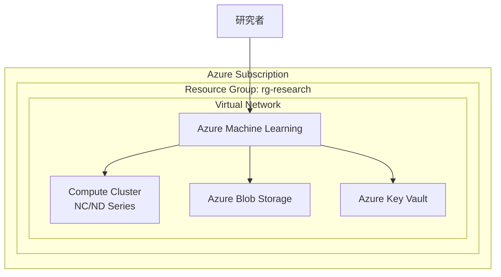
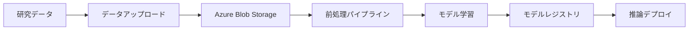

# Azure 研究基盤構成設計書

## 1. 設計概要

### 対象研究
<!-- 研究テーマ名を記載 -->

### 設計方針
<!-- アーキテクチャの設計方針・コンセプト -->

## 2. アーキテクチャ図

## 3. リソース構成

### コンピューティング

| リソース | サービス | SKU | 数量 | 用途 |
|---------|---------|-----|------|------|
| | | | | |

### ストレージ

| リソース | サービス | SKU | 容量 | 用途 |
|---------|---------|-----|------|------|
| | | | | |

### ネットワーク

| リソース | サービス | 構成 | 用途 |
|---------|---------|------|------|
| | | | |

### セキュリティ

| リソース | サービス | 構成 | 用途 |
|---------|---------|------|------|
| | | | |

## 4. データフロー

## 5. セキュリティ設計

### ネットワーク分離
<!-- VNet, NSG, Private Endpoint の構成 -->

### アクセス制御
<!-- RBAC, Managed Identity の構成 -->

### データ保護
<!-- 暗号化、バックアップの構成 -->

## 6. スケーラビリティ設計

### オートスケール設定
<!-- Compute Cluster のスケール設定 -->

### スポット VM 活用
<!-- コスト最適化のためのスポットVM設定 -->

## 7. リージョン選定

| 候補リージョン | GPU 可用性 | レイテンシ | 選定理由 |
|-------------|-----------|----------|---------|
| Japan East | | | |
| Japan West | | | |
| East US | | | |
