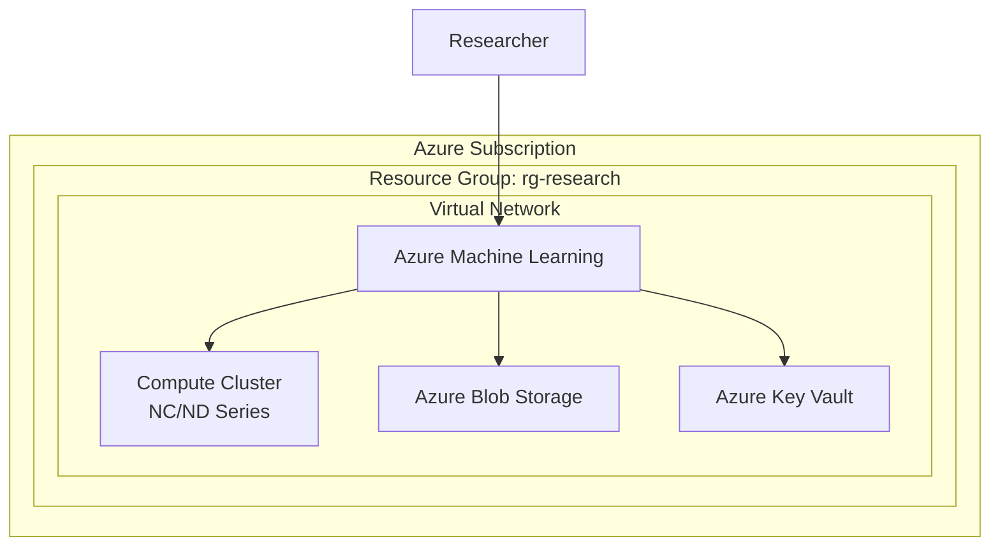
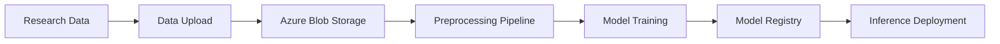

# Azure Research Infrastructure Design Document

## 1. Design Overview

### Target Research
<!-- Research theme name -->

### Design Principles
<!-- Architecture design principles and concept -->

## 2. Architecture Diagram

## 3. Resource Configuration

### Compute

| Resource | Service | SKU | Quantity | Purpose |
|----------|---------|-----|----------|---------|
| | | | | |

### Storage

| Resource | Service | SKU | Capacity | Purpose |
|----------|---------|-----|----------|---------|
| | | | | |

### Network

| Resource | Service | Configuration | Purpose |
|----------|---------|---------------|---------|
| | | | |

### Security

| Resource | Service | Configuration | Purpose |
|----------|---------|---------------|---------|
| | | | |

## 4. Data Flow

## 5. Security Design

### Network Isolation
<!-- VNet, NSG, Private Endpoint configuration -->

### Access Control
<!-- RBAC, Managed Identity configuration -->

### Data Protection
<!-- Encryption, backup configuration -->

## 6. Scalability Design

### Autoscale Settings
<!-- Compute Cluster scale settings -->

### Spot VM Utilization
<!-- Spot VM settings for cost optimization -->

## 7. Region Selection

| Candidate Region | GPU Availability | Latency | Selection Rationale |
|-----------------|-----------------|---------|---------------------|
| Japan East | | | |
| Japan West | | | |
| East US | | | |

## 8. WAF Best Practices Compliance

Design validation results based on the 5 pillars of the Azure Well-Architected Framework.

### 検証サマリー

| 柱 | 適合状況 | 主な適合事項 | 要改善事項 |
|---|---------|-----------|----------|
| 信頼性 | ✅ / ⚠️ / ❌ | | |
| セキュリティ | ✅ / ⚠️ / ❌ | | |
| コスト最適化 | ✅ / ⚠️ / ❌ | | |
| 運用優秀性 | ✅ / ⚠️ / ❌ | | |
| パフォーマンス効率 | ✅ / ⚠️ / ❌ | | |

### 参照した WAF Service Guide

<!-- 設計で参照した Microsoft Learn WAF Service Guide の URL を記載 -->

| サービス | WAF Service Guide |
|---------|------------------|
| | |
