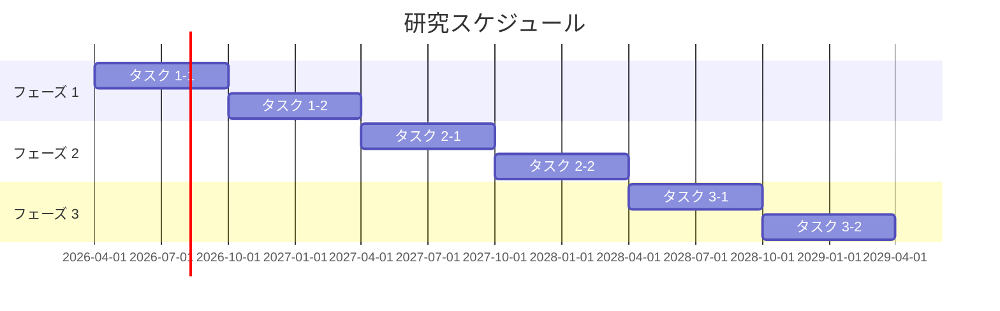

# SPReAD 申請書テンプレート

## 研究課題名

<!-- 研究課題名を記載（40字以内を推奨） -->

## 1. 研究の背景と目的

### 1.1 学術的背景

<!-- 当該研究分野の現状と課題 -->

### 1.2 研究目的

<!-- 本研究で達成する具体的な目的 -->

### 1.3 学術的意義と社会的インパクト

<!-- 研究成果がもたらす学術的・社会的価値 -->

## 2. AI for Science としての革新性

### 2.1 従来手法の限界

<!-- 従来の研究手法では解決困難な課題 -->

### 2.2 AI 活用による革新

<!-- AI 技術の導入によって初めて可能になるアプローチ -->

### 2.3 AI 活用戦略

<!-- 具体的な AI 技術・手法の選定理由と活用方法 -->
<!-- Phase 0 の AI 活用戦略セクションから統合 -->

## 3. 研究計画・方法論

### 3.1 研究の全体像

<!-- 研究の全体構成・フェーズ分け -->

### 3.2 各フェーズの詳細計画

#### フェーズ 1: <!-- 名称 -->（<!-- 期間 -->）
<!-- 具体的な活動内容・手法 -->

#### フェーズ 2: <!-- 名称 -->（<!-- 期間 -->）
<!-- 具体的な活動内容・手法 -->

#### フェーズ 3: <!-- 名称 -->（<!-- 期間 -->）
<!-- 具体的な活動内容・手法 -->

### 3.3 使用するデータ

<!-- データの種類・取得方法・規模 -->

### 3.4 評価指標

<!-- 研究成果の評価方法・指標 -->

## 4. 研究基盤計画（Azure 活用）

### 4.1 システムアーキテクチャ

<!-- Phase 1 のアーキテクチャ設計から要約 -->

### 4.2 主要リソース構成

<!-- 使用する Azure サービスと構成の概要 -->

### 4.3 データ管理計画

<!-- データの保存・管理・共有方法 -->

### 4.4 セキュリティ対策

<!-- データ保護・アクセス制御の方針 -->

## 5. 経費計画

### 5.1 経費総括表

| 費目 | 年度1 (千円) | 年度2 (千円) | 年度3 (千円) | 合計 (千円) |
|------|-----------|-----------|-----------|-----------|
| クラウド利用費 | | | | |
| 設備備品費 | | | | |
| 消耗品費 | | | | |
| 旅費 | | | | |
| 人件費・謝金 | | | | |
| その他 | | | | |
| **合計** | | | | |

### 5.2 積算根拠

<!-- 各費目の詳細な積算根拠 -->
<!-- Phase 2 のコスト見積もりから統合 -->

### 5.3 コスト最適化方針

<!-- スポットVM活用、リザーブドインスタンス等の最適化策 -->

## 6. AI 利活用のノウハウ抽出・共有計画

<!-- knowhow-sharing-template.md を参照して記載 -->

### 6.1 抽出するノウハウ

<!-- 本研究から得られる AI 活用の知見・方法論 -->

### 6.2 共有・展開方法

<!-- 他分野への知見共有の具体的方法（論文・データセット公開・ワークショップ等） -->

## 6. 研究体制

### 6.1 研究代表者

| 氏名 | 所属 | 役職 | 役割 |
|------|------|------|------|
| | | | |

### 6.2 研究分担者

| 氏名 | 所属 | 役職 | 役割 |
|------|------|------|------|
| | | | |

### 6.3 研究協力者

| 氏名/組織 | 連携内容 |
|----------|---------|
| | |

## 7. 研究スケジュール

## 8. 期待される成果

### 8.1 学術的成果

<!-- 論文発表、学会発表等 -->

### 8.2 社会実装への展望

<!-- 研究成果の社会実装・産業応用の可能性 -->

### 8.3 人材育成

<!-- 若手研究者・学生への波及効果 -->

## 9. 研究倫理・データ管理

### 9.1 研究倫理への対応

<!-- 倫理審査、インフォームドコンセント等 -->

### 9.2 データ管理ポリシー

<!-- オープンデータ方針、データ保存期間等 -->

### 9.3 利益相反

<!-- 利益相反に関する開示 -->

---

> **⚠️ 免責事項**: 本文書は AI（SPReAD Builder）が生成した参考資料です。内容の正確性・完全性は保証されません。公的機関への提出前に、応募者ご自身の責任で内容を精査・修正してください。
